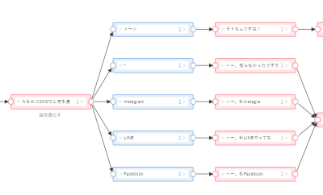
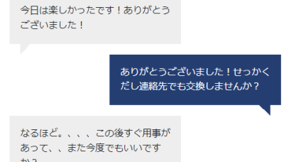

# 2022年度研究プロジェクト 前半発表

- SUNABAによる対話システムの実装
- リトリーバル方式の雑談システムの試作

情報通信系3年 河合輝良 (担当教員: 船越孝太郎)

<!-- 情報通信系3年の河合輝良です。よろしくお願いします。
前半の研究プロジェクトでは、船越先生ご指導のもと、自然言語処理について学びました。
今回は、発表課題として「SUNABAによる対話システム」と「リトリーバル方式の雑談システム」を実装しましたので発表します。 -->

---

## 対話システムとは

自然言語を用いて人間と会話ができるようにしたシステム

- SUNABAを用いた対話システムの実装
- リトリーバル方式の応答選択手法を用いた雑談システムの試作

<!-- まず初めに、対話システムとは、自然言語を用いて人間と会話ができるようにしたシステムのことを指します。 -->

---

## SUNABA

- ドコモが開発したチャットボット製作サービス
- GUIを使用し、ノーコードで作ることが可能
- 今回は「連絡先をやんわりと断る」というテーマでシナリオを作成

 

<!-- 前半ではSUNABAを用いて「連絡先をやんわりと断る」というシナリオを作成しました。
SUNABAは、ドコモが開発したチャットボット製作サービスで、GUIを用いてノーコードで作ることもできます。 -->

---

## リトリーバル方式

- 現在の状態に基づいて、システムの発話DBの中から応答を選んで返す方式
- ここでは、直前の入力発話を現在の状態とみなす
  - 過去の入力は考慮しない

<!-- 後半ではリトリーバル方式の雑談システムを実装しました。
リトリーバル方式とは、ユーザーの発話に対し発話DBから最も適した応答を選んで返すことで会話をする方式です。
応答は、直前の入力発話のみを考慮するオートマトンのような形式となっています。 -->

---

## 発話DB

- ある発話とその発話に対する応答のペアを記録したもの
- 対話破綻検出チャレンジ(2015年)の雑談対話コーパスを使用
  - <https://sites.google.com/site/dialoguebreakdowndetection/chat-dialogue-corpus>

zipファイルの中身↓ (重要箇所のみ)

```text
chat-dialogue-corpus
├── json
│  ├── init100
│  │  ├── 1407219916.log.json
│  │  └── ...
│  └── rest1046
│     ├── 1404365812.log.json
│     └── ...
└── ...
```

<!-- ここで登場した発話DBとは、ある発話とその発話の応答のペアを記録したものを指します。
(今回は対話破綻検出チャレンジの雑談対話コーパスを使用しています。) -->

---

## 発話DB - コーパスの加工

各JSONファイルの中身↓ (重要箇所のみ)

```json
{
  "turns": [
    { "utterance": "今日は最高気温36度だって。暑いねえ" },
    { "utterance": "最高気温は１７度が予想されます？？" },
    { "utterance": "いやいや猛暑ですよ" },
    ...
  ]
}
```

発話とその応答がペアになるように加工↓ (実装ではJSONではなくGoのmapを使用)

```json
{
  "今日は最高気温36度だって。暑いねえ": "最高気温は１７度が予想されます？？",
  "最高気温は１７度が予想されます？？": "いやいや猛暑ですよ",
  ...
}
```

<!-- 実装段階では、スライドのように対話どうしがペアになるように加工しています。 -->

---

## 雑談システムの実装

- 応答選択手法(発話に対して最適な応答をDBから選択する手法)が必要
- どのように選択すればよいか？ = どのような評価指標を用いるか？
  - 次ページから解説
    - 完全一致
    - 編集距離
    - TF\*IDF指標
  - 今回は扱わないがニューラルネットワークを用いた、よりモダンなもの
    - word2vec
    - BERT
    - ...

<!-- 雑談システムを実装するためには、最適な応答を選んで返すための評価手法が必要になります。
今回は、スライドのうち完全一致、編集距離、TF-IDF指標を実装しました。
ここでは扱いませんが、word2vecやBERTといった、ニューラルネットワークを用いてより高次元のデータから応答を選択する手法もあります。
これらの評価手法について、次のスライドから1つずつ詳細を見ていきます。 -->

---

## 応答選択手法 - 完全一致

- 発話とDBの中の発話が完全一致しているものを選択
- なければ`"I don't know."`

<!-- 完全一致システムは最も単純な方法です。
受け取った発話と全く同じものがDBにあればそれを選択します。 -->

---

## 応答選択手法 - 編集距離

- 編集距離: ある文字列から別の文字列への変換手順の最小回数
  - 1回の変換には挿入、削除、置換の3つの操作のいずれかを用いる
  - 「けんぷろ」と「すたんぷ」の編集距離は3
    - けんぷろ→けんぷ(削除)→たんぷ(置換)→すたんぷ(挿入)
- 発話とDBの中の発話の編集距離が最小になるものを選択

<!-- 編集距離とは、ある文字列から別の文字列に変換するために最低限必要な変換回数のことを指します。
受け取った発話から最も編集距離が短いDB発話を応答とします。 -->

---

## 応答選択手法 - TF\*IDF指標

発話A: 「犬/と/猫/なら/犬/派/です」発話B: 「私/は/人間/です」

- TF\*IDF: TF(Term Frequency)とIDF(Inverse Document Frequency)の積
  - TF\*IDF(A, "犬") = 0.286 \* 0.176 = 0.0503
  - **その発話に出現する頻度が高く、かつ他の発話には出現しない単語は重要**
- TF: (発話中の単語`w`の出現回数) / (発話中の単語の総数)
  - TF(A, "犬") = 2 / 7 = 0.286
  - その発話に出現する頻度が高い単語は重要
- IDF: log((1+総発話数) / (1+単語`w`を含む発話数))
  - IDF([A,B], "です") = log((1+2) / (1+2)) = 0
  - どの発話にも出現する単語は重要ではない
- 発話とDBの中の発話のTF\*IDFのコサイン類似度が最大になるものを選択

<!-- TF-IDF指標は、「ある発話に対し、その発話に出現する頻度が高く、かつ他の発話には出現しない単語は重要」という事実に基づいた指標です。
1つの発話中のある1単語の頻度を表すTFと全発話中のある1単語の希少性を表すIDFの積で計算されます。
受け取った発話とTF-IDFのコサイン類似度が最も高いDB発話を応答とします。 -->

---

# 実装

<!-- 用語の説明は以上です。
次のスライドから実装について解説します。 -->

---

## 完成後イメージ

```bash
$ ./research-project1
# ? Which method do you want to use?:
#     Exact Match
#   ▸ Edit Distance
#     TF*IDF
✔ Edit Distance
Input your message: こんにちは
response: こんちわー

Input your message: おはよう、元気ですか？█
response: 元気です

...
```

<!-- 今回は、コマンドラインで動く対話システムを実装しました。
応答選択手法を選んだ後、発話を入力するとそれに適した応答を出力してくれます。 -->

---

## 方針

- レポジトリ: <https://github.com/ras0q/research-project1>
- Go言語を使用
- [manifoldco/promptui](https://github.com/manifoldco/promptui)を使いインタラクティブなCLIを作成
- 指標の計算には外部パッケージ(ライブラリ)を用いる → 次ページ

<!-- 実装の方針として、Go言語を使用し、外部パッケージを用いることで様々な指標で対話システムを構築することができるようにしました。 -->

---

## 使用パッケージ (Github)

- [agnivade/levenshtein](https://github.com/agnivade/levenshtein)
  - 編集距離の計算
- [ikawaha/kagome](https://github.com/ikawaha/kagome)
  - 日本語文書の形態素解析 (文書を単語に分割)
  - 辞書はmecab-ipadic-2.7.0-20070801を使用
  - TF\*IDF指標の計算に使用
- [wilcosheh/tfidf](https://github.com/wilcosheh/tfidf)
  - TF\*IDF指標の計算
  - 発話とのコサイン類似度の計算

<!-- 今回指標の計算に用いたパッケージはこの3つです。
編集距離、TF-IDF指標の計算用のパッケージとは別に、日本語を単語に分けるための形態素解析パッケージを使用しています。 -->

---

## 結果

編集距離

```bash
$ ./research-project1
✔ Edit Distance
Input your message: 今日も元気かい？
response: 元気です (dist=5, ref=元気？)

Input your message: 最近寒くなってきたね
response: 熱中症に気をつけか？？ (dist=4, ref=最近涼しくなったね)
```

TF\*IDF指標

```bash
$ ./research-project1
✔ TF*IDF
Input your message: 今日も元気かい？
response: そうです (score=0.794234, ref=そうかい)

Input your message: 最近寒くなってきたね
response: 海に行かないんですね？ (score=0.869657, ref=でも少し寒くなってきましたよ。)
```

<!-- 実装後の結果はこのようになりました。完全一致は省略しています。
どちらも基本的な会話なら正しく応答できますが、季節のことなどやや発展的なことを聞くと応答が破綻してしまいます。
ただし、参照したDB発話を見ると分かるように元のコーパスの精度が良くないとも考えられるため、
より多くのデータを用いると精度も上がると考えられます。 -->

---

## 課題

- 今回用いた外部パッケージには最終更新が5年以上前のものもあるので自分で実装出来ればなお良かった
  - Goは後方互換性が保たれているので、バージョンが上がっても基本問題なく使うことはできる
- 指導教員からはさらにモダンな方法も紹介されていたが実装が間に合わなかった
  - word2vecやBERTなどのモデルを用いた方法
  - TF\*IDFでコサイン類似度を用いた方法を試せたのはよかった

<!-- 今後の課題としては、指標の計算を自分で実装してみる、word2vecやBERTといったさらにモダンな方法でも実装してみる、といったことが挙げられます。 -->

---

# ご清聴ありがとうございました

<!-- 発表は以上になります。ご清聴ありがとうございました。 -->
