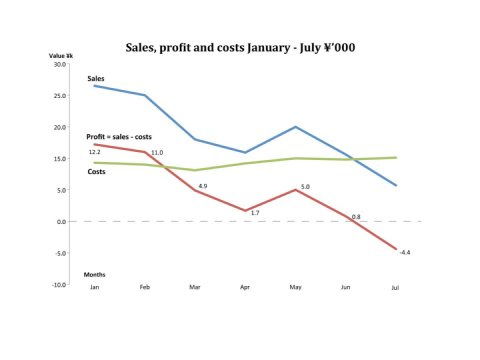
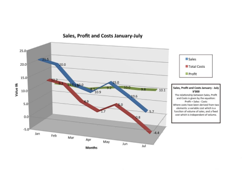
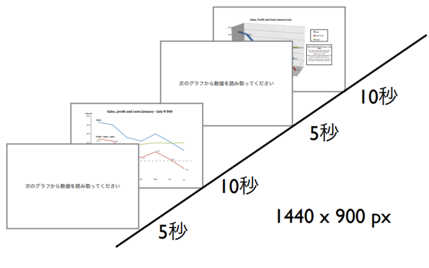
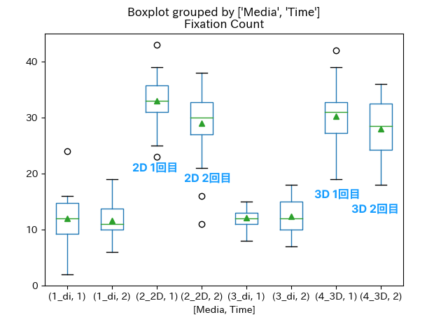
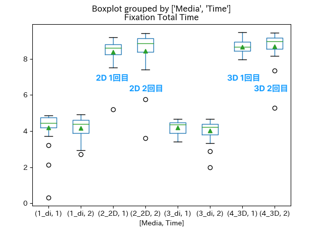
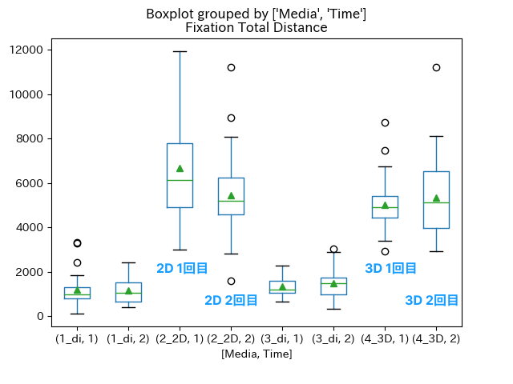

<!-- markdownlint-disable MD024-->

# 2022年度研究プロジェクト 後半発表

データ表示形式による注視活動の違いを眼球運動計測によって評価比較する

情報通信系3年 河合輝良 (担当教員: 中山実)

---

## 実験内容

- 同じグラフを2Dと3Dでそれぞれ10秒ずつ提示し、注視活動を計測する
  - グラフを提示する前に5秒間ずつ問題文が提示される

 

---

## 実験内容

- 実験は2回行う
  - 1回目は特に指示を行わず自由観察
  - 2回目は特定の数値を読み取るよう指示

---

## 測定方法

- 2019年に測定した6人のデータを使用
- アイマークデータ解析ソフトウェア「EMR-dStream2」を使用
  - 両目の動きを時系列で記録できる
  - 複数画像の切り替わりにも対応
- CSV形式のデータをPythonで分析
  - 注視点の総数
  - 総注視時間
  - 注視点間の総距離
  - 注視点の動き

---

## 実験結果 - 注視点の動き1

- 指示文はややばらつき増加
- 2Dグラフは2回目で指定された箇所への注視が増加

<!-- group1/sub2/R -->

---

## 実験結果 - 注視点の動き2

- 指示文はややばらつき増加
- 2Dグラフはタイトルや説明文への注視が減少し、グラフの中への注視が増加

<!-- group1/sub2/R -->

---

## 実験結果 - 注視点の総数

- 指示文はともにほぼ変化せず
- グラフはともに減少

---

## 実験結果 - 総注視時間

- 指示文はともに若干減少
- グラフはともに中央値は増加したが平均はほぼ変化せず

---

## 実験結果 - 注視点間の総距離

- 指示文はともに平均、中央値はほぼ変わらず、ばらつきが増加
- 2Dグラフは減少したが3Dグラフはやや増加

---

## 考察

- 1回目は何も指示されていなことから、どこを見ればよいか分からないため細かなデータよりもタイトル、説明文も含めた画像全体を見ることが多い
- 2回目は特定の数値を読み取る必要があることから、説明文よりもグラフ中の特定のデータに注視するように
- 2回目は既に一度見ているため、グラフに関して注視点の数は減少し、特定箇所への注視時間が増加した
